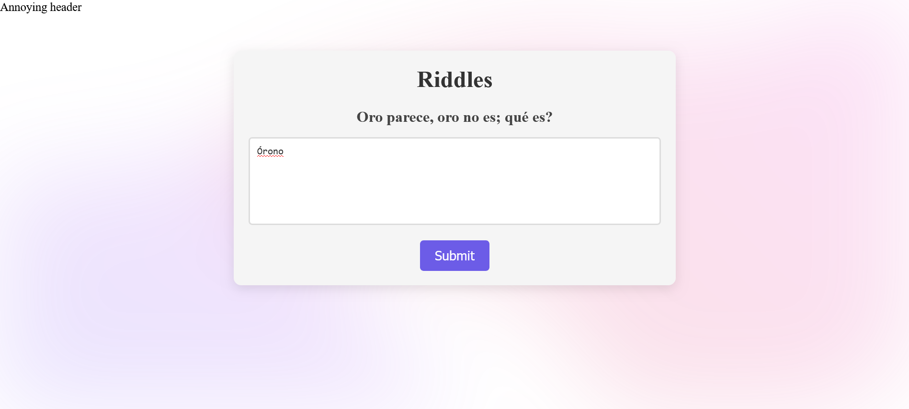

# web-riddler

<p align="center">
  
</p>

A web game where an LLM riddles you. Play it [here](https://web-riddler.vercel.app/).

__In progress...__

* **Astro**: A framework for building fast websites (combined with Svelte).
* **Svelte**: A framework for building user interface components.
* **TypeScript**: A superset of JavaScript that adds static typing.
* **Tailwind CSS**: A utility-first CSS framework.
* **Custom API**: Contains an API in `src/pages/api/embedding.ts`.

# Requirements:
* [Node.js](https://nodejs.org/) ([for Linux](https://nodejs.org/en/download)) (recommended version: 16 or higher).
* [npm](https://docs.npmjs.com/cli/v8/commands/npm-install) or [yarn](https://classic.yarnpkg.com/lang/en/docs/install/#windows-stable): Package managers included with Node.js.
* [VS Code](https://code.visualstudio.com/docs/setup/setup-overview).

# Steps:

1. Clone the project and navigate to the root directory:  
   ```bash
   cd /opt/guessword
```
2. Install dependencies defined in the ```package.json``` file from the project root:
```bash
npm install
```
3. Start the development web server with Astro at ```http://localhost:4321```:
```bash
npx astro dev
```
4. (Optional) Build a production-ready version:
```bash
npx astro build
```

# Hosting Options:
Aside from running the website locally, deploying it on a hosting platform is necessary to make it accessible from anywhere. Some hosting options include:

- Static Hosting Platforms (recommended for Astro)
	- Vercel (used here): Optimized for frameworks like Astro, fast, and integrates automatically with GitHub/GitLab.
	- Netlify: Ideal for static projects or serverless functions.
	- GitHub Pages: For free hosting, though it doesn't directly support serverless functions.
- Full Hosting
	- VPS (Virtual Private Server): Use servers like DigitalOcean, AWS EC2, or Linode to manually configure the environment.
	- Heroku, Render: Supports both static applications and dynamic backends; these are paid platforms.
- Container Platforms
	- Docker + Kubernetes: Fully self-contained for more complex projects.

# Create an App Like This from Scratch:
* Install: Node.js and Git.
* Have accounts on Vercel and Hugging Face.
* Initialize an **Astro** project inside the repository folder: ```npm create astro@latest```. Follow the usual steps to create a project with a directory structure like this:
```
alejandro@pop-os:/opt/proyectos/web-riddler/$ tree -L 1
.
├── astro.config.mjs
├── node_modules
├── package.json
├── package-lock.json
├── public
├── README.md
├── src
└── tsconfig.json
```
And the src/ folder may look something like this:
```
src/
├── components/      # Svelte components
│   ├── Header.svelte
│   ├── Footer.svelte
│   ├── Riddles.svelte
├── layouts/         # General designs
│   ├── MainLayout.astro
├── pages/           # Main routes of the app
│   ├── index.astro
├── styles/          # Global styles
│   ├── global.css
```

* Install the necessary dependencies inside the created project: ```npm install```.
* Run the project locally to verify it works: ```npm run dev```. The Astro starter app will open in the browser at ```http://localhost:4321```. Check [this](./assets/README_astro.md).
* Configure **Vercel** for production deployment: Instalar the Vercel CLI: ```npm i -g vercel```. Connect the project to Vercel: ```vercel```. Follow the instructions (log in and link the project to your Vercel account).
* Deploy the app: ```vercel deploy```. This generates a URL where the web app can be accessed remotely. On Vercel’s web interface, under Settings => Domain, you can see the domain name, e.g.: ```web-riddler.vercel.app```.
* Use **HuggingFace** by visiting their [Hub](https://huggingface.co/models) and selecting an appropriate LLM model, e.g., for analyzing text and providing feedback: [all-MiniLM-L6-v2](https://huggingface.co/sentence-transformers/all-MiniLM-L6-v2) 
* Create an access token on Hugging Face via Profile => Access Token => Create new token, with simple read permissions.
* Add an API endpoint to interact with the model. In Astro, you can create an API route to handle requests. To keep the key protected, Vercel integrates environment variables of the project in Settings => Environment Variables. Also, one can connect Vercel with Git repository to create a Production Deployment.
* Make sure to have these dependencies installed: ```npm install -D typescript svelte-preprocess @sveltejs/vite-plugin-svelte @astrojs/svelte svelte``` and ```npx astro add vercel```
* Ensure that you include everything you need in ```tsconfig.json``` and ```astro.config.mjs```, for example, for Svelte and TypeScript integration.
* If any traouble, remove old caché ```rm -rf .vite```

You can now start customizing the project template to add the desired functionality and Svelte components, referring to the documentation of these tools.

When making changes to the project, once you are satisfied and have tested locally using: ```npm run dev```

You can redeploy to production with: ```vercel deploy --prod```. The app will update automatically on the custom domain.

# VS Code Extensions:
* Svelte
* Svelte Preview
* Tailwind CSS IntelliSense
* TypeScript
* Astro

# References:
- [The Net Ninja - Astro Tutorial](https://www.youtube.com/watch?v=gUs-Sissb48&ab_channel=NetNinja)
- [Notpron](https://es.wikipedia.org/wiki/Notpron)
- [Some riddles](https://huggingface.co/datasets/flyingfishinwater/riddle/blob/main/riddle.jsonl)

# TODO
* Win popup if exact match or goes above a threshold (e.g. 98 %)
* Use a script to automatically fix typos in the riddles database (e.g. dont allow numbers, neither dots, only short texts, etc.)

